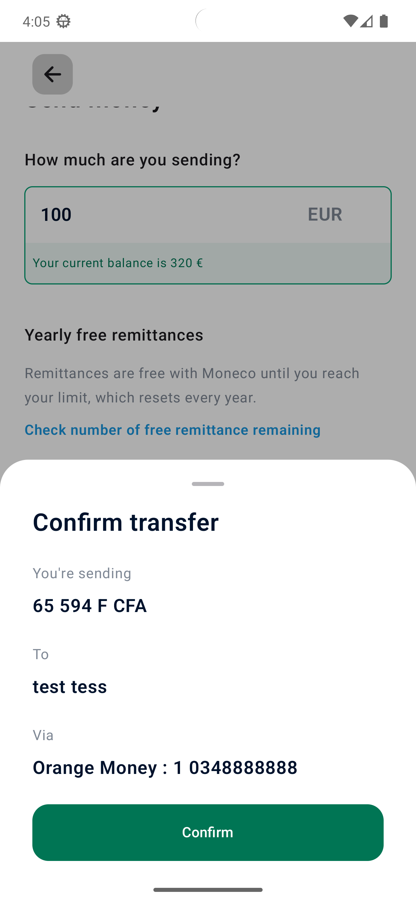

## Prerequisites

Before building and running the app, ensure that you have the following:

- Android Studio (latest stable version recommended) installed on your machine.
- Android SDK with a minimum API level of 23 installed.

## Screenshots

  
  
  
  
  
  
  
  

## Tech Stack

The RemitConnect app is built using the following technologies and libraries:

- Android Studio: The official integrated development environment (IDE) for Android app development.
- Kotlin: The programming language used for developing the Android app.
- Android SDK: The software development kit that provides the necessary tools and libraries for Android app development.
- Jetpack Compose: A modern UI toolkit for building native Android apps with a declarative approach.
- Dagger Hilt: A dependency injection library for Android that simplifies the setup and management of dependencies.
- Room: A persistence library that provides an abstraction layer over SQLite for database operations.
- Retrofit: A type-safe HTTP client for Android and Java to simplify the process of interacting with web services and APIs.
- Coroutine: Kotlin's native asynchronous programming framework for managing concurrency and simplifying asynchronous code.

## Troubleshooting

If you have issues building or running the app, try these steps:

- Ensure you have a stable internet connection.
- Verify your Android SDK is installed and up to date.
- Check that your device or emulator meets the required API level.
- Clean and rebuild the project via "Build" > "Clean Project" and then "Build" > "Rebuild Project".
- If you encounter dependency errors, click the "Sync Project with Gradle Files" button in the toolbar.